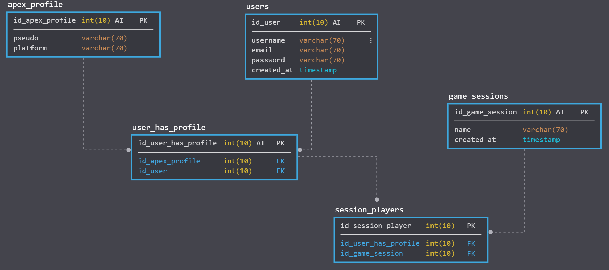

# An Apex App

## Required

For the moment, to be abble to use this app, you have to install expo globally in your environmnent develppement and download expo app on your phone.
Please check the expo's [doc](https://expo.io/learn)

```
npm install -g expo-cli
```

You need a module to load and refresh automatically the back-end, i use nodemon.

You also need to have node and npm.

## Get started

```
https://github.com/AsyVasy/react-native-app.git
```

For the front-end:

```
cd react-native-app
npm install
```

for the back-end

```
cd react-native-app/back
npm install
nodemon server.js
```



You can find a dump of the database [here](assets/an_apex_app.sql)

You will have to create a `config.var.js` in `/back/utils` to be abble to connect on your database and to use apex api.

```javascript
module.exports = () => {
	const mysql = require('mysql');

	const connection = {
		host: 'YoUr_HoSt_LoCaTiOn',
		user: 'YoUr_UsErNaMe',
		password: 'YoUr_Db_PaSsWoRd',
		database: 'an_apex_app',
	};

	const apex_header = {
		headers: {
			'***-***-***': '********-****-****-****-************',
		},
	};

	return { connection, apex_header };
};
```

The apex-api-tracker won't work without a token. I can't give you mine but you will find one [here](https://apex.tracker.gg/)
